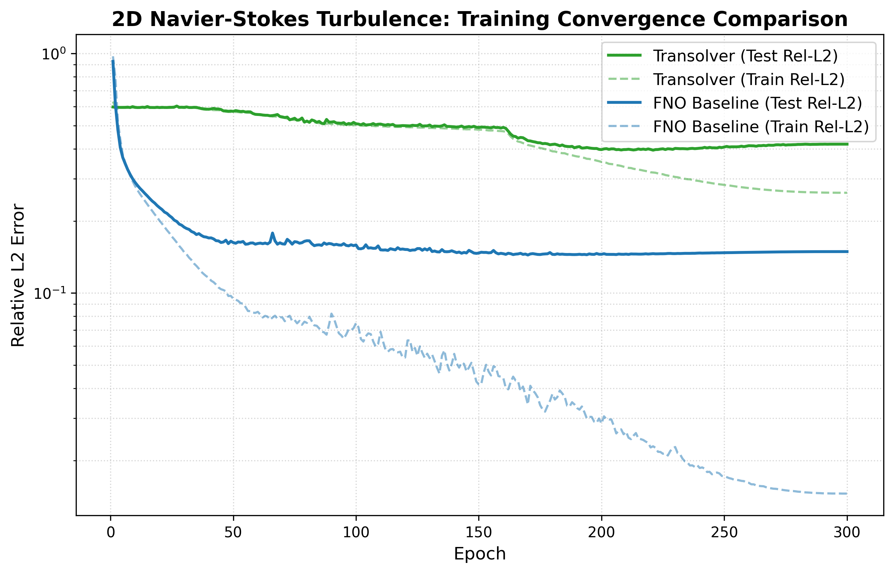
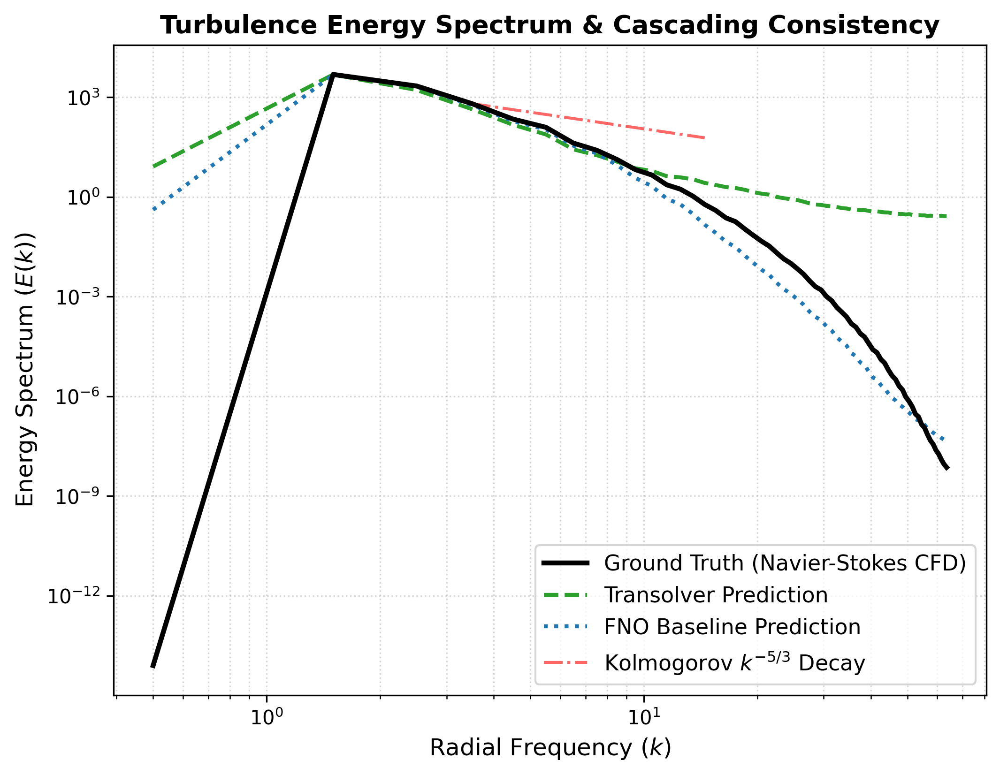
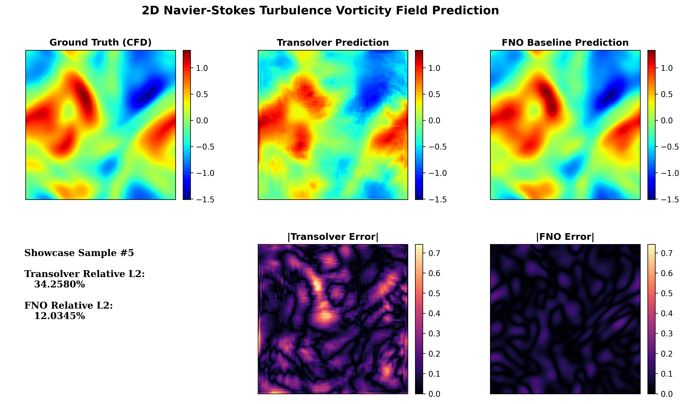

# SciML Showcase: Turbulence and Aerodynamics Benchmarking

This directory contains two extensions built on top of the upstream
[Transolver](https://github.com/thuml/Transolver) (Wu et al., ICML 2024)
codebase: a Transolver-vs-FNO benchmark on 2D Navier-Stokes turbulence, and
an unstructured-grid (VTU/VTP) training pipeline for airfoil RANS surrogates.
See the [root README](../README.md) for overall repo attribution.

Neither pipeline is intended to replace classical numerical CFD solvers.
The goal is a fast, mesh-independent surrogate that can support design-loop
iteration and data-engineering around existing solvers.

## Directory structure

* [`ns_turbulence/`](ns_turbulence) — Phase 1: 2D Navier-Stokes vorticity dynamics
  * [`exp_ns_turbulence.py`](ns_turbulence/exp_ns_turbulence.py) — Trains the Transolver operator.
  * [`exp_fno_baseline.py`](ns_turbulence/exp_fno_baseline.py) — Trains the Fourier Neural Operator (FNO) baseline under identical normalization.
  * [`compare_models.py`](ns_turbulence/compare_models.py) — Evaluation suite (relative L2 curves, parameter counts, inference latency, side-by-side vorticity contours, 1D radial energy spectrum).
* [`airfoil_rans/`](airfoil_rans) — Phase 2: geometry-general unstructured-grid surrogates
  * [`generate_mock_airfrans.py`](airfoil_rans/generate_mock_airfrans.py) — Generates a synthetic AirfRANS-style unstructured grid dataset (quadrilateral VTU internal grid, VTP surface boundary) to exercise the pipeline end-to-end.
  * [`main.py`](airfoil_rans/main.py) — Geometry-general surrogate training over volume/surface boundaries with coordinate projection and a weighted surface+volume loss.

## Phase 1: 2D Navier-Stokes turbulence benchmark

**Objective**: train continuous, mesh-independent operators to predict
next-step vorticity fields and check that the learned dynamics obey the
expected turbulence energy-cascade scaling.

### Results

Measured on the 128x128 NS-forcing dataset (`nsforcing_train_128.pt` /
`nsforcing_test_128.pt`, 1000 train / 200 test samples used), both models
trained for 300 epochs with matched normalization, loss, and grid
coordinates:

| Metric | FNO baseline | Transolver |
| :--- | :---: | :---: |
| Test relative L2 error | **0.144 ± 0.017** | 0.395 ± 0.040 |
| Trainable parameters | 2.80M | **1.42M** |
| Avg. inference latency (per sample) | **2.04 ms** | 7.80 ms |

FNO reaches roughly **2.7x lower error** and **3.8x lower latency** here;
Transolver uses **2x fewer parameters**. This is with each model's default
hyperparameters and an identical 300-epoch budget — it is not a
hyperparameter-tuned head-to-head, so treat it as a first honest baseline
rather than a final verdict on either architecture.

> **Note on the dataset**: `ns_train_64.pt` / `ns_test_64.pt` (the 64x64
> files originally shipped alongside the 128x128 ones) are degenerate — the
> "samples" are near-duplicates of a single field (per-pixel variance across
> samples is ~4 orders of magnitude below the spatial variance within one
> sample), and the input field carries essentially no correlation with the
> target (~0.01). A model can hit near-zero reported error there just by
> learning the constant/mean field, which is not a meaningful benchmark.
> Use the 128x128 `nsforcing_*` files instead.



* **Kolmogorov k^(-5/3) energy-cascade check**: `compare_models.py` projects predicted vorticity fields into Fourier space to compute the 1D radial energy spectrum E(k) and compares it against the analytical Kolmogorov inertial-range decay rate (k^(-5/3)). FNO's spectrum tracks the ground-truth decay closely through the small-scale (high-k) range; Transolver's flattens out at high k, i.e. it over-smooths fine-scale structure relative to FNO.





### Running the experiments

Set the dataset location once. The scripts expect files named
`ns_train_<res>.pt` / `ns_test_<res>.pt`; if you're using the real 128x128
data (named `nsforcing_train_128.pt` / `nsforcing_test_128.pt` upstream),
symlink them to the expected names in a local directory first:
```bash
mkdir -p /path/to/ns_data_128
ln -s /path/to/fno/navier_stokes/nsforcing_train_128.pt /path/to/ns_data_128/ns_train_128.pt
ln -s /path/to/fno/navier_stokes/nsforcing_test_128.pt  /path/to/ns_data_128/ns_test_128.pt
export NS_DATA_DIR=/path/to/ns_data_128
```

Train Transolver and the FNO baseline:
```bash
python3 sciml_showcase/ns_turbulence/exp_ns_turbulence.py --gpu 0 --resolution 128
python3 sciml_showcase/ns_turbulence/exp_fno_baseline.py --gpu 0 --resolution 128
```

The FNO baseline imports the `neuraloperator` package
(https://github.com/neuraloperator/neuraloperator). If it is not
pip-installed, point `$NEURALOPERATOR_DIR` at a local checkout.

Run the comparison suite (pass the same resolution via `$NS_RESOLUTION`):
```bash
export NS_RESOLUTION=128
python3 sciml_showcase/ns_turbulence/compare_models.py
```
Outputs are written to `results/comparison_ns/` (overridable via
`$NS_RESULTS_DIR`), including `loss_curves_comparison.png`,
`energy_spectrum_comparison.png`, and `flow_comparison_showcase_{5,12,28}.png`.

## Phase 2: unstructured-grid aerodynamics (AirfRANS-style)

**Objective**: predict RANS flow fields (velocity U, pressure p, turbulent
viscosity nu_t) around 2D airfoils on unstructured mesh grids, for varying
Reynolds number and angle of attack.

* **Unstructured grid parsing**: reads `.vtu` (internal fluid volume) and `.vtp` (surface wall) meshes with PyVista and VTK.
* **Status**: the pipeline is validated end-to-end on synthetic (mock)
  AirfRANS-style geometries generated by `generate_mock_airfrans.py`.
  Real-dataset (AirfRANS) benchmarking is pending — no result logs for a
  real-dataset run exist in this repo yet.

### Running the experiments (mock dataset)

```bash
export AIRFRANS_DATA_DIR=/path/to/dataset   # or omit to use a local ./mock_dataset

python3 sciml_showcase/airfoil_rans/generate_mock_airfrans.py
python3 sciml_showcase/airfoil_rans/main.py --model Transolver --weight 10.0
```
